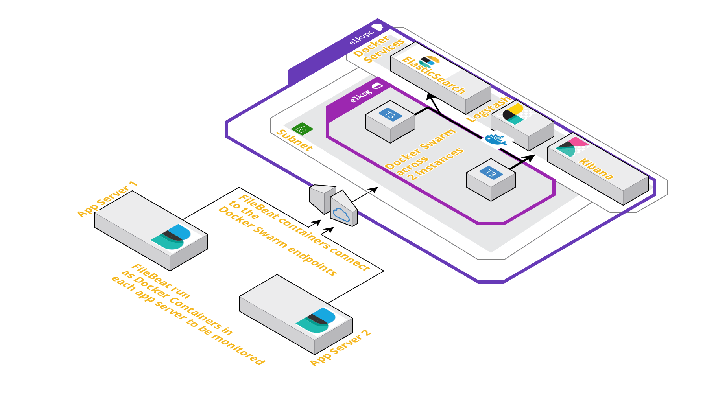
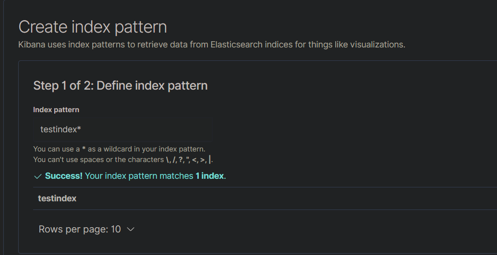
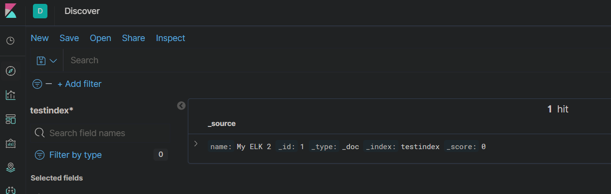

# Deploy an ELK stack as Docker services to a Docker Swarm on AWS- Part 1

In this 2-part post, I will be walking through a way to deploy the <strong>E</strong>lasticsearch, <strong>L</strong>ogstash, <strong>K</strong>ibana (ELK) Stack. 
In part-1 of the post, I will be walking through the steps to deploy Elasticsearch and Kibana to the Docker swarm. In part-2 of the post, I will going through steps to deploy Logstash and Filebeat services to gather the log data. 
I am using custom Docker images for Elasticsearch and Kibana to customize settings through custom config files for both.I have also included both Dockerfiles and the custom config files in the repo. If any other custom settings are needed, define the parameters in the config file and rebuild the images from the Dockerfiles.  

The code files can be found in the below Github repo:  
https://github.com/amlana21/elkstack-publish

## What is ELK Stack  
ELK stack is an acronym for a stack of services which consist of three open source projects: Elasticsearch, Logstash, Kibana.This stack provides ability to aggregate logs from multiple app servers and monitor, analyze, visualize the logs.Below is a brief description of each of the three services:  
 - Elasticsearch: This is an open-source, distributed search and analytics engine. This is ideal for log analytics use cases.  
 - Logstash: This is an open-source log ingestion tool which aggregates log data from various sources.  
 - Kibana: This is an open-source data visualization tool which can used to create visual dashboards based on the input log data.  

## Architecture and Infrastructure  
For the stack I will be using the below architecture for the services to interact with each other. Each service will be launched as Docker services in a Docker Swarm across two EC2 instances. The services are replicated only once.  

  

The infrastructure resources required for the three Docker services, can be launched as a stack using a Cloudformation template. I have included the template in the Github repo. That template can be used to launch a Cloudformation stack which will provision the necessary networking resources and the Instances.Once the instances are launched, latest Docker need to be installed on the instances and the Docker service need to be started.  

## Prepare Individual Components  
Below we will prepare two services Elasticsearch and Kibana, as Docker services, separately beofore merging them in a single Docker-compose file.  

 ### Elasticsearch  
 Below is the Docker compose snippet which will launch an Elasticsearch Docker service. 
 ```
 version: '3.1'

services:
  elasticsearch:
    image: awsacdev/custom-elasticsearch:1.0
    environment:
      - discovery.type=single-node
      - bootstrap.memory_lock=true
      - "ES_JAVA_OPTS=-Xms512m -Xmx512m"
      - "ELASTIC_PASSWORD=myesPassword"
    volumes:
      - esdata:/usr/share/elasticsearch/data
    ports:
      - 9200:9200
      - 9300:9300
    networks:
      - esnet

volumes:
  esdata:
    driver: local

networks:
  esnet:
```  
 This uses a custom Elasticsearch image to customize the Elasticsearch option using a customized elasticsearch config file.The image can be found on DOcker hub: https://hub.docker.com/u/awsacdev.  
 This also sets a default password for the built-in user 'elastic'.To test the service, use the below command on a system where Docker,Docker compose is installed.  
 ```
 docker-compose up
 ```
 To check whether the service is up and running, wait for a few minutes for the service to fully come online. Then navigate to this URL(change based on instance ip/domain): http://<machine_domain_or_ip>:9200  
 It should show a pop up to provide credentials. The username and Password are elastic and myesPassword. Once entered it should show some basic details about the elastic search service. That confirms service is running successfully.  

 ### Kibana  
 Below docker-compose snippet will launch Kibana as a docker service. It uses a custom Kibana Docker image which can be found on the above mentioned Docker hub profile. I have also included the Dockerfile in the code repo.The custom image enables to use the custom kibana config file(kibana.yml).  
 ```
 version: '3.1'

services:
  kibana:
    image: awsacdev/custom-kibana:1.0
    environment:
      - SERVER_NAME=kibana.local
      - ELASTICSEARCH_URL=http://elasticsearch:9200
    ports:
      - 5601:5601
    networks:
      - esnet

networks:
  esnet:
  ```

To test the service, below command can executed. Make sure this is executed in a different folder than the earlier elasticsearch docker-compose file.  
```
docker-compose up
```

If this service is launched standalone then thre will be errors since Elastic search wont be available. To check if the service is launched successfully, check the Docker launch console outputs. There will be errors showing that it cannot find the Elasticsearch service. That is normal as we dont have the Elasticsearch yet. 

## Deploy the Stack to Docker Swarm  
Now that we have tested the services separately, next we will be deploying both of the services as a stack to Docker swarm.First step is to initialize the swarm mode. Run the following command on the instance which is supposed to be the manager node:  
```
docker swarm init --advertise-addr $(hostname -i)
```
From the output of the above command, copy the swarm join command and run the command on the worker node after SSH'ing to the worker node.  
```
docker swarm join <rest of copied command>
``` 
Once the swarm is ready, next we need to launch the Docker stack with the two services. Below is the compose file code to deploy the stack. Copy the below code snippet and create a file called docker-stack.yml. 
```
version: '3.1'

services:
  elasticsearch:
    image: awsacdev/custom-elasticsearch:1.0
    environment:
      - discovery.type=single-node
      - bootstrap.memory_lock=true
      - "ES_JAVA_OPTS=-Xms512m -Xmx512m"
      - "ELASTIC_PASSWORD=myesPassword"
    volumes:
      - esdata:/usr/share/elasticsearch/data
    ports:
      - 9200:9200
      - 9300:9300
    networks:
      - esnet

  kibana:
    image: awsacdev/custom-kibana:1.0
    environment:
      - SERVER_NAME=kibana.local
      - ELASTICSEARCH_URL=http://elasticsearch:9200
    ports:
      - 5601:5601
    networks:
      - esnet


volumes:
  esdata:
    driver: local

networks:
  esnet:
  ```  
This will launch two Docker services. It will take few minutes for both of the services to come fully online. Run the below command to deploy the stack:  
```
docker stack deploy -c docker-stack.yml elkapp
```
To check whether the services are successfully deployed, run the following command and from the output check if the replicas are launched:  
```
docker stack services elkapp
```
Once the services are launched, we can move on to test and confirm that the services are working fine.  

## Test the services  
To test the below steps, we will use Postman. That will be used to send REST API requests to the Elasticsearch endpoints.  

 - <strong>Create index in Elasticsearch:</strong> Send a PUT request to the elasticsearch endpoint with the following details. If the response is success then Elasticsearch service is working fine.  
  1. URL: http://<instance_domain_or_ip>:9200/testindex/_doc/1?pretty
  2. Body: {"name": "My ELK 2" }
  3. Basic Auth: Username:elastic, Password: myesPassword  
  <strong>Success Response: </strong>
  ```
  {
  "_index": "testindex",
  "_type": "_doc",
  "_id": "1",
  "_version": 1,
  "result": "created",
  "_shards": {
    "total": 2,
    "successful": 1,
    "failed": 0
  },
  "_seq_no": 0,
  "_primary_term": 1
}

```  

 - <strong>Test Kibana and verify Elasticsearch connection:</strong>  Next we will test if Kibana is working fine and is able to connect to the Elasticsearch service. We will test if the index which we created in previous step, is visible in Kibana. Below are the steps to be performed in Kibana:  
  1. Open Kibana URL: http://<instance_domain_or_ip>:5601
  2. Enter the credentials: Username:elastic, Password: myesPassword 
  3. Once logged in Navigate to the Discover tab and define an index pattern:  
     
  4. Save the Index pattern  
  5. Navigate back to the Discover tab. It should show the Index we created through the Elasticsearch API:  
     
  6. This confirms that Kibana service is also operational and is able to connect to the Elastic search service  

## Conclusion  
In this post we went through the steps to deploy the Elasticsearch and Kibana services to Docker swarm. In next part of the post I will go though the steps to deploy Logstash service to the Docker swarm and complete the ELK stack deployment. Though this setup is not suitable for a Production environment, this setup can be used to experiment with the API's. For a production environment, Nginx can be added as a reverse proxy and other Production related settings can be configured in the custom config files for both Elasticsearch and Kibana.If there are any questions, raise an issue on the Github repo or email me at amlanc@achakladar.com.